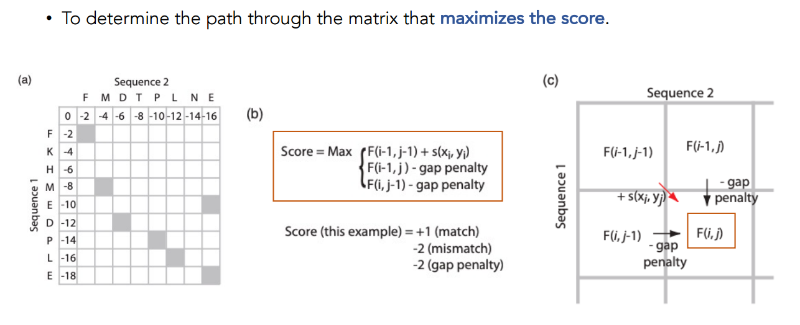

### Needleman-Wunsch Algorithm Flow

The **Needleman-Wunsch** algorithm is used for global sequence alignment. It works by filling a dynamic programming (DP) matrix that represents the optimal alignment score between two sequences at each position, considering possible matches, mismatches, and gap penalties. Here's the process, as illustrated in the image:

1. **Initialization**:

   * The DP matrix is initialized with the first row and column representing gap penalties.

     * The first row represents the alignment of the first sequence with gaps in the second sequence.
     * The first column represents the alignment of the second sequence with gaps in the first sequence.

2. **Matrix Filling**:

   * For each cell in the DP matrix (excluding the first row and column), the score is computed as the maximum of:

     * The diagonal score (coming from the previous row and column) + a score based on whether the characters match or mismatch.
     * The score from the left cell (indicating a gap in the second sequence) + a gap penalty.
     * The score from the top cell (indicating a gap in the first sequence) + a gap penalty.

   This is shown in the recurrence relation:

   $$ \text{Score}(i, j) = \max \left( F(i-1, j-1) + s(x_i, y_j), F(i-1, j) - \text{gap penalty}, F(i, j-1) - \text{gap penalty} \right) $$

3. **Traceback**:

   * After filling the matrix, we trace back from the bottom-right corner (final cell) to the top-left corner (starting cell) to determine the optimal alignment.
   * During the traceback:

     * If the score came from the diagonal, it means the characters match (or mismatch).
     * If the score came from the left, it means a gap is inserted in the first sequence.
     * If the score came from above, it means a gap is inserted in the second sequence.

4. **Alignment**:

   * Using the traceback path, the final aligned sequences are formed by adding the corresponding characters from both sequences, and inserting gaps where necessary.

